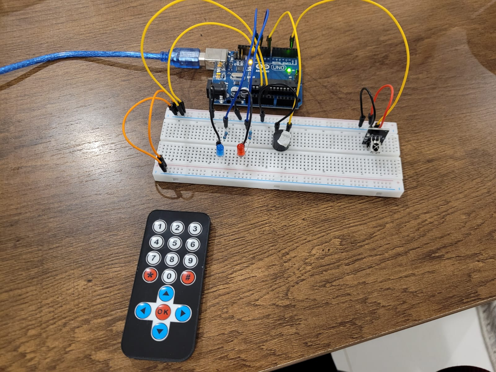
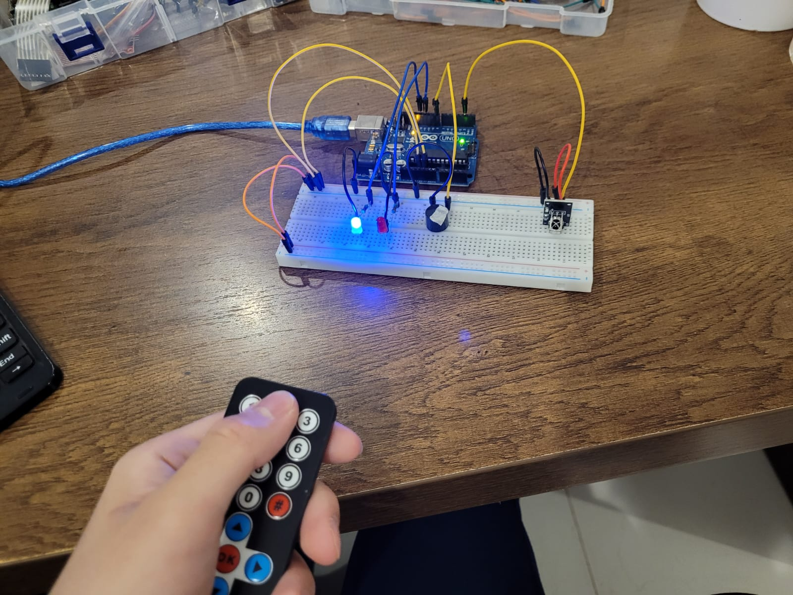
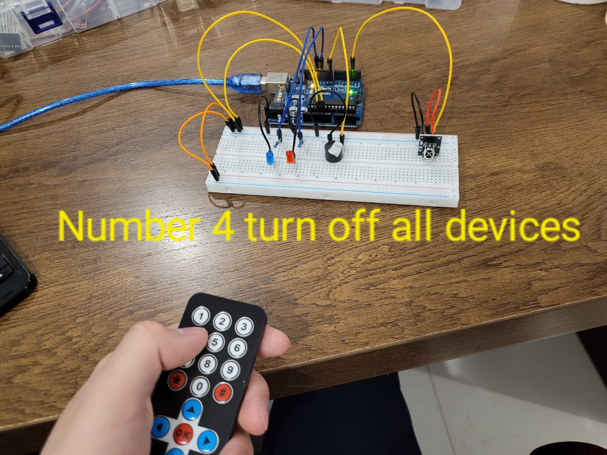

# Arduino---Remote-IR-Controlled-Multi-Device

# Description:
This project is an Arduino-based remote control system where each button on the infrared remote controls a specific device or component.

Pressing button 1 toggles the red LED ON and OFF.

Pressing button 2 toggles the blue LED ON and OFF.

Pressing and holding button 3 activates a buzzer continuously; releasing the button stops the buzzer.

Pressing button 4 turns OFF all devices (both LEDs and the buzzer).

# pictures:





# Code below:
```cpp
#include <IRremote.hpp>

IRrecv ir(2); // IR receiver on pin 2

byte redLED = 11;
byte blueLED = 12;
byte buzzer = 8;

bool redLEDstate = false;
bool blueLEDstate = false;

unsigned long lastSignalTime = 0;     
const unsigned long timeout = 300;    

void setup() {
  ir.enableIRIn();
  pinMode(redLED, OUTPUT);
  pinMode(blueLED, OUTPUT);
  pinMode(buzzer, OUTPUT);
  Serial.begin(9600);
}

void loop() {
  if (ir.decode()) {
    int signal = ir.decodedIRData.command;

    
    if (signal == 69) {
      digitalWrite(blueLED, LOW);
      blueLEDstate = false;

      redLEDstate = !redLEDstate;
      digitalWrite(redLED, redLEDstate);
    }

    
    else if (signal == 70) {
      digitalWrite(redLED, LOW);
      redLEDstate = false;

      blueLEDstate = !blueLEDstate;
      digitalWrite(blueLED, blueLEDstate);
    }

    
    else if (signal == 68) {
      digitalWrite(redLED, LOW);
      digitalWrite(blueLED, LOW);
      redLEDstate = false;
      blueLEDstate = false;
    }

    
    if (signal == 71) {
      lastSignalTime = millis(); 
    }

    ir.resume();
    Serial.println(signal);
  }


  if (millis() - lastSignalTime < timeout) {
    digitalWrite(buzzer, HIGH);
  } else {
    digitalWrite(buzzer, LOW);
  }
}

```
